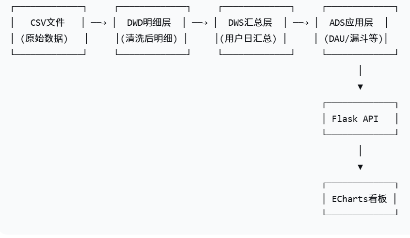
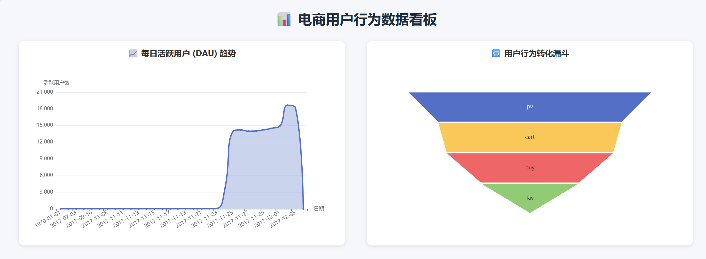
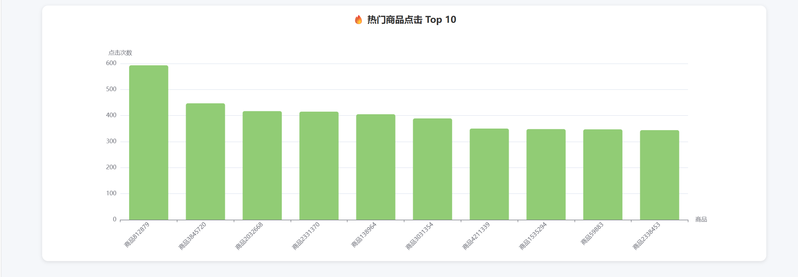

# 电商用户行为数据仓库与可视化看板

## 项目背景
本项目模拟电商平台的离线数据仓库建设，对用户行为数据（点击、收藏、加购、购买）进行 ETL 处理，并产出业务报表，最终通过 Flask + ECharts 实现可视化看板。

## 技术栈
- Python (pandas, sqlalchemy, pymysql)
- MySQL (数据仓库)
- Flask (Web 后端)
- ECharts (数据可视化)

## 数据源
阿里云天池 - 淘宝用户行为数据集（约 200 万条记录）
## 📁 项目结构
```text
user_behavior_dw_project/
├── app.py # Flask 主程序
├── etl.py # ETL 脚本（分块读取+清洗）
├── requirements.txt # Python 依赖
├── sample_data.csv # 样例数据（小数据集）
├── README.md # 项目说明文档
├── templates/
│ └── dashboard.html # 可视化前端模板
└── images/
├── architecture.png # 系统架构图
├── dau_chart1.png # DAU 效果图1
└── dau_chart2.png # DAU 效果图2
```


## 系统架构


## 数据流转
CSV → DWD(明细层) → DWS(汇总层) → ADS(应用层) → 可视化看板

## 核心功能
1. 自动化 ETL：分块读取大数据文件，清洗并存入 MySQL DWD 表
2. 数仓分层建模：DWD → DWS → ADS
3. 业务指标分析：日活跃用户(DAU)、转化漏斗、热门商品等
4. 可视化看板：展示 DAU 趋势图

## 如何运行

### 1. 环境准备
- 安装 MySQL 8.0+
- 创建数据库 `itcast`
- 安装 Python 依赖：`pip install -r requirements.txt`

### 2. 执行 ETL

#### 2.1 生成 DWD 表（运行 ETL 脚本）
```bash
python etl.py
```
#### 2.2 创建 DWS 和 ADS 表
- 在 MySQL 客户端（或任意 SQL 工具）中，依次执行以下 SQL 语句：

- 创建 DWS 表并聚合数据（用户-日汇总）

- 创建 DAU 表 ads_daily_active_users

- 创建漏斗表 ads_funnel

- 创建热门商品表 ads_hot_products

- 添加索引优化查询
### 3. 启动可视化看板
```bash
python app.py
```
- 访问 http://127.0.0.1:5000 查看图表。

- 项目效果
 

- 下一步优化
使用调度工具（如 Airflow）定时执行 ETL、
部署到云服务器

作者
平成城
GitHub: https://github.com/77889023/user-behavior-data-warehouse